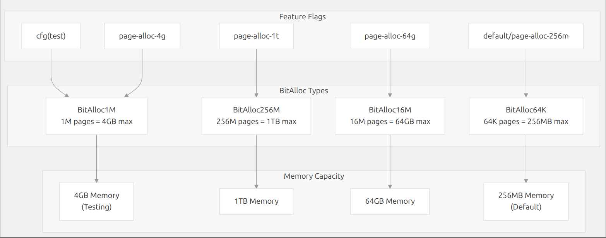
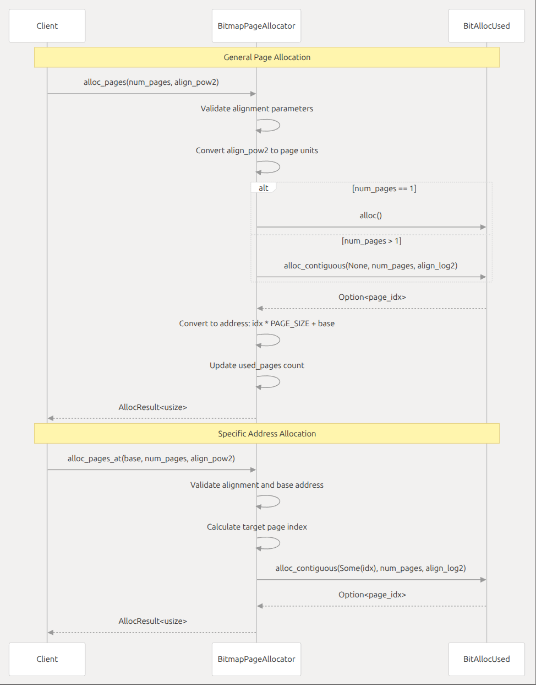
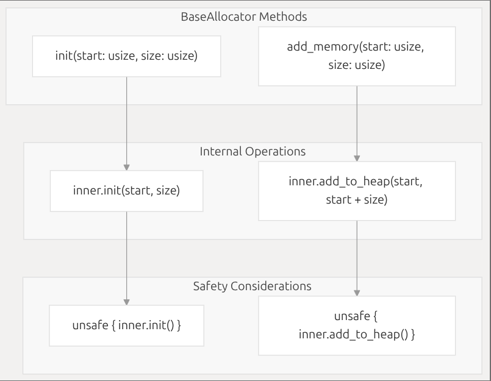
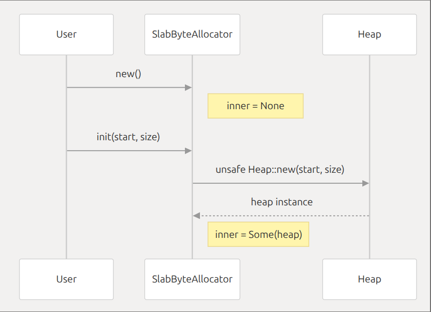
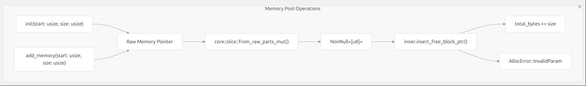

### allocator模块概述

该项目实现了多种内存分配算法，通过统一的接口将这些算法封装起来，方便开发者根据不同的需求选择合适的分配器。项目支持多种特性开关，可根据需要启用不同的分配器。
- **target中有另一个同名doc文件夹，其中有html文件可以在浏览器交互阅读**  
好像被ignored了，可以在本地cargo doc生成

### 项目结构和模块
.  
├── benches  
│   ├── collections.rs  
│   └── utils  
│       └── mod.rs  
├── Cargo.lock  
├── Cargo.toml  
├── doc  
│   ├── pic  
│   │   ├── bitmap_allocate.png  
│   │   ├── bitmap.png  
│   │   ├── buddy.png  
│   │   ├── concrete_implementation.png  
│   │   ├── slab.png  
│   │   ├── test1.png  
│   │   ├── test2.png  
│   │   ├── test3.png  
│   │   ├── test4.png  
│   │   ├── test5.png  
│   │   ├── tlsf_memory_operation.png  
│   │   └── trait.png  
│   └── README.md  
├── LICENSE  
├── LICENSE-Apache-2.0  
├── LICENSE-GPL-3.0-or-later  
├── output.md  
├── src  
│   ├── bitmap.rs  
│   ├── buddy.rs  
│   ├── lib.rs  
│   ├── slab.rs  
│   └── tlsf.rs  
└── tests  
    ├── allocator.rs  
    ├── test1.rs  
    ├── test2.rs  
    ├── test3.rs  
    ├── test4.rs  
    └── test5.rs  


- **`src/lib.rs`**: 项目的核心文件，定义了统一的分配器接口，包括`BaseAllocator`、字节粒度分配器、页粒度分配器和唯一 ID 分配器的接口。同时，提供了一些辅助函数，如地址对齐和检查对齐的函数。此外，还实现了 `AllocatorRc` 结构体，用于将字节分配器包装成 `core::alloc::Allocator` 类型。
- **`src/bitmap.rs`**: 实现了基于位图的页粒度内存分配器 `BitmapPageAllocator`。使用位图来跟踪每个页面的分配状态，支持不同大小的内存范围。
- **`src/buddy.rs`**: 实现了基于伙伴系统的字节粒度内存分配器 `BuddyByteAllocator`。使用 `buddy_system_allocator` 库来管理内存。
- **`src/slab.rs`**: 实现了基于 slab 分配器的字节粒度内存分配器 `SlabByteAllocator`。使用 `slab_allocator` 库来管理内存。
- **`src/tlsf.rs`**: 实现了基于 TLSF（Two-Level Segregated Fit）算法的字节粒度内存分配器 `TlsfByteAllocator`。使用 `rlsf` 库来管理内存。
- **`benches/collections.rs`**: 使用 criterion 库编写的​​内存分配器性能基准测试套件​​，定义了三种内存操作场景，模拟真实应用场景中的内存使用模式：vec_push,vec_rand_free,btree_map，分别对应的是模拟动态数组增长，模拟内存碎片化场景，模拟关联容器操作
- **`benches/utils/mod.rs`**: 实现了一个简单的​​固定大小内存池​​（MemoryPool），主要用于管理预分配的内存块


### Feature

#### 项目中通过 `cfg` 特性开关来控制不同模块和功能的编译，以下是所有可用的特性开关及其作用

##### 1. **`bitmap`**

- **作用**：启用基于位图的页粒度内存分配器。
- **关联模块**：`bitmap.rs`
- **导出类型**：`BitmapPageAllocator`
- **功能**：使用位图数据结构管理页级内存分配，适合管理大块连续内存区域。

##### 2. **`buddy`**

- **作用**：启用基于伙伴系统的字节粒度内存分配器。
- **关联模块**：`buddy.rs`
- **导出类型**：`BuddyByteAllocator`
- **功能**：基于伙伴系统算法实现细粒度内存分配，适合需要处理不同大小内存块的场景。

##### 3. **`slab`**

- **作用**：启用基于 slab 分配器的字节粒度内存分配器。
- **关联模块**：`slab.rs`
- **导出类型**：`SlabByteAllocator`
- **功能**：针对特定大小对象的高效分配，减少内部碎片，适合频繁分配 / 释放相同大小对象的场景。

##### 4. **`tlsf`**

- **作用**：启用基于 TLSF（Two-Level Segregated Fit）算法的字节粒度内存分配器。
- **关联模块**：`tlsf.rs`
- **导出类型**：`TlsfByteAllocator`
- **功能**：结合多级空闲列表和位图索引，实现高效的内存分配与回收，尤其适合分配不同大小内存块的场景。

##### 5. **`allocator_api`**

- **作用**：启用与 Rust 标准库内存分配器接口的集成。
- **关联模块**：`allocator_api` 子模块
- **导出类型**：`AllocatorRc`
- **功能**：将自定义字节分配器（`ByteAllocator`）包装为实现 `core::alloc::Allocator` 特征的类型，允许在需要标准分配器接口的场景中使用自定义分配器（如 `Rc`、`Box` 等）。

### Trait
- 基于trait对项目整体结构进行介绍


### 具体实现
### lib.rs
### 1.分配器架构实现
采取分层结构设计，先定义基础层(BaseAllocator)，再按照具体分配需求设计专用层ByteAllocator：字节级内存分配（如 Buddy/Slab 算法）
PageAllocator：页级内存分配（如 Bitmap 算法）
IdAllocator：唯一 ID 分配（如线程 ID）
最后通过模块化实现用特性开关启用具体算法实现
```rust
#[cfg(feature = "buddy")]
mod buddy;
pub use buddy::BuddyByteAllocator;
```
### 2.核心特性实现
- **`ByteAllocator`**:
```rust
fn alloc(&mut self, layout: Layout) -> AllocResult<NonNull<u8>>;
fn dealloc(&mut self, pos: NonNull<u8>, layout: Layout);
```
通过 Layout 结构体接收分配请求的尺寸和对齐要求，返回分配的内存地址或错误信息。
- **`PageAllocator`**:
```rust
const PAGE_SIZE: usize;
fn alloc(&mut self, layout: Layout) -> AllocResult<NonNull<u8>>;
```
必须指定页面大小，除此之外，align_pow2要求对其到2的幂次地址，最后通过used_pages返回已分配的页数管理物理页
- **`IdAllocator`**:
```rust
/// Whether the given `id` was allocated.
    fn is_allocated(&self, id: usize) -> bool;

    /// Mark the given `id` has been allocated and cannot be reallocated.
    fn alloc_fixed_id(&mut self, id: usize) -> AllocResult;
            
```
提供了ID状态查询，并确保不会再分配相同的ID

### 3.辅助的工具函数
- **地址对齐**:
```rust
#[inline]
const fn align_down(pos: usize, align: usize) -> usize {
    pos & !(align - 1)
}

#[inline]
const fn align_up(pos: usize, align: usize) -> usize {
    (pos + align - 1) & !(align - 1)
}
```
### 4.错误处理机制
``` rust
pub enum AllocError {
    InvalidParam,    // 参数不合法（如未对齐）
    MemoryOverlap,   // 内存区域重叠
    NoMemory,        // 内存不足
    NotAllocated,    // 释放未分配区域
}
```

### bitmap.rs
```rust
use bitmap_allocator::BitAlloc; // 引入位图分配器库作为底层分配器
```
### 根据编译特性采取不同的分配器实现
```rust
cfg_if::cfg_if! {
    if #[cfg(test)] {
        /// Use 4GB memory for testing.
        type BitAllocUsed = bitmap_allocator::BitAlloc1M;
    } else if #[cfg(feature = "page-alloc-1t")] {
        /// Support max 256M * PAGE_SIZE = 1TB memory (assume that PAGE_SIZE = 4KB).
        type BitAllocUsed = bitmap_allocator::BitAlloc256M;
    } else if #[cfg(feature = "page-alloc-64g")] {
        /// Support max 16M * PAGE_SIZE = 64GB memory (assume that PAGE_SIZE = 4KB).
        type BitAllocUsed = bitmap_allocator::BitAlloc16M;
    } else if #[cfg(feature = "page-alloc-4g")] {
        /// Support max 1M * PAGE_SIZE = 4GB memory (assume that PAGE_SIZE = 4KB).
        type BitAllocUsed = bitmap_allocator::BitAlloc1M;
    } else {// #[cfg(feature = "page-alloc-256m")]
        /// Support max 64K * PAGE_SIZE = 256MB memory (assume that PAGE_SIZE = 4KB).
        type BitAllocUsed = bitmap_allocator::BitAlloc64K;
    }
}
```


### 初始化一个分配器
```rust
pub struct BitmapPageAllocator<const PAGE_SIZE: usize> {
    base: usize,
    total_pages: usize,
    used_pages: usize,
    inner: BitAllocUsed,
}

impl<const PAGE_SIZE: usize> BitmapPageAllocator<PAGE_SIZE> {
    /// Creates a new empty `BitmapPageAllocator`.
    pub const fn new() -> Self {
        Self {
            base: 0,
            total_pages: 0,
            used_pages: 0,
            inner: BitAllocUsed::DEFAULT,
        }
    }
}
```

### 具体分配过程（一般分配）
```rust
fn alloc_pages(&mut self, num_pages: usize, align_pow2: usize) -> AllocResult<usize> {
    // Check if the alignment is valid.
    if align_pow2 > MAX_ALIGN_1GB || !crate::is_aligned(align_pow2, PAGE_SIZE) {
        return Err(AllocError::InvalidParam);
    }
    let align_pow2 = align_pow2 / PAGE_SIZE;
    if !align_pow2.is_power_of_two() {
        return Err(AllocError::InvalidParam);
    }
    let align_log2 = align_pow2.trailing_zeros() as usize;
    match num_pages.cmp(&1) {
        core::cmp::Ordering::Equal => self.inner.alloc().map(|idx| idx * PAGE_SIZE + self.base),
        core::cmp::Ordering::Greater => self
            .inner
            .alloc_contiguous(None, num_pages, align_log2)
            .map(|idx| idx * PAGE_SIZE + self.base),
        _ => return Err(AllocError::InvalidParam),
    }
    .ok_or(AllocError::NoMemory)
    .inspect(|_| self.used_pages += num_pages)
}
```
如果超出上限，或不是页大小的整数倍，返回错误信息；否则进行下一步验证：转换为页大小的整数倍，检查是否是2的幂次，计算对齐的log2值，调用alloc_contiguous进行分配，返回分配的地址。
### 具体分配过程（指定分配地址）
```rust
/// Allocate pages at a specific address.
fn alloc_pages_at(
    &mut self,
    base: usize,
    num_pages: usize,
    align_pow2: usize,
) -> AllocResult<usize> {
    // Check if the alignment is valid,
    // and the base address is aligned to the given alignment.
    if align_pow2 > MAX_ALIGN_1GB
        || !crate::is_aligned(align_pow2, PAGE_SIZE)
        || !crate::is_aligned(base, align_pow2)
    {
        return Err(AllocError::InvalidParam);
    }

    let align_pow2 = align_pow2 / PAGE_SIZE;
    if !align_pow2.is_power_of_two() {
        return Err(AllocError::InvalidParam);
    }
    let align_log2 = align_pow2.trailing_zeros() as usize;

    let idx = (base - self.base) / PAGE_SIZE;

    self.inner
        .alloc_contiguous(Some(idx), num_pages, align_log2)
        .map(|idx| idx * PAGE_SIZE + self.base)
        .ok_or(AllocError::NoMemory)
        .inspect(|_| self.used_pages += num_pages)
}
```
相比于一般分配，多了一个基址base的检查


### 释放部分
```rust
fn dealloc_pages(&mut self, pos: usize, num_pages: usize) {
    assert!(
        crate::is_aligned(pos, Self::PAGE_SIZE),
        "pos must be aligned to PAGE_SIZE"
    );
    if match num_pages.cmp(&1) {
        core::cmp::Ordering::Equal => self.inner.dealloc((pos - self.base) / PAGE_SIZE),
        core::cmp::Ordering::Greater => self
            .inner
            .dealloc_contiguous((pos - self.base) / PAGE_SIZE, num_pages),
        _ => false,
    } {
        self.used_pages -= num_pages;
    }
}
```
检查一下目标地址是否对齐，然后调用dealloc_contiguous进行释放

### example
```rust
// test1.rs
// 单页分配的样例
use allocator::{BaseAllocator, PageAllocator, BitmapPageAllocator, AllocError};

const PAGE_SIZE: usize = 4096;

#[test] 
fn test_page_allocation() -> Result<(), AllocError> {
    let mut allocator = BitmapPageAllocator::<PAGE_SIZE>::new();
    allocator.init(0x1000, PAGE_SIZE);
    
    let addr = allocator.alloc_pages(1, PAGE_SIZE)?;
    println!("Allocated page at: 0x{:X}", addr);
    
    allocator.dealloc_pages(addr, 1);
    Ok(())
}
```
```rust
// test2.rs
// 多页分配的样例
use allocator::{BaseAllocator, PageAllocator, BitmapPageAllocator, AllocError};

const PAGE_SIZE: usize = 4096; // 4KB页大小
const MEM_BASE: usize = 0x1000; // 内存池起始地址
const MEM_SIZE: usize = 8 * 1024 * 1024; // 8MB内存池

#[test]
fn test_multi_page_allocation() -> Result<(), AllocError> {
    let mut allocator = BitmapPageAllocator::<PAGE_SIZE>::new();
    allocator.init(MEM_BASE, MEM_SIZE);
    
    // 分配连续4页（16KB）
    let num_pages = 4;
    let addr = allocator.alloc_pages(num_pages, PAGE_SIZE)?;
    println!("[多页分配] 起始地址: 0x{:X}, 页数: {}", addr, num_pages);
    
    // 验证地址对齐和连续性
    assert!(addr % PAGE_SIZE == 0, "地址未对齐");
    assert!(addr >= MEM_BASE && addr < MEM_BASE + MEM_SIZE, "地址越界");
    
    allocator.dealloc_pages(addr, num_pages);
    Ok(())
}

#[test]
fn test_specific_address_allocation() -> Result<(), AllocError> {
    let mut allocator = BitmapPageAllocator::<PAGE_SIZE>::new();
    allocator.init(MEM_BASE, MEM_SIZE);
    
    // 确保地址满足2MB对齐（关键修正）
    let align = 2 * 1024 * 1024; // 2MB对齐
    let target_addr = (MEM_BASE + align - 1) & !(align - 1); // 对齐到最近的2MB边界
    
    let num_pages = 2;
    
    // 在指定地址分配2页
    let addr = allocator.alloc_pages_at(target_addr, num_pages, align)?;
    println!("[指定地址分配] 请求地址: 0x{:X}, 实际地址: 0x{:X}", target_addr, addr);
    
    // 验证地址精确匹配
    assert_eq!(addr, target_addr, "分配地址与请求不匹配");
    assert!(addr % align == 0, "地址未满足对齐要求");
    
    allocator.dealloc_pages(addr, num_pages);
    Ok(())
}
```
读者可自行测试，运行命令cargo test --test [对应测试文件名称]  

### buddy.rs
buddy的核心思想是将内存划分为大小为 2^n 的块。分配时，系统查找最小能满足请求的块；如果块过大，则递归分裂为两个大小相等的“伙伴”块。释放时，系统检查相邻伙伴块是否空闲，若空闲则合并为更大的块。这减少了内存碎片并提高了分配效率，在这里buddy提供字节粒度的内存分配

```rust
use buddy_system_allocator::Heap;
use core::alloc::Layout;
use core::ptr::NonNull;

use crate::{AllocError, AllocResult, BaseAllocator, ByteAllocator};
```
引入buddy_system_allocator库作为底层分配器，定义了Heap结构体，用于管理内存池

### 具体实现
BuddyByteAllocator 结构体是分配器的入口，内部封装 Heap<32> 实现伙伴系统逻辑。
```rust
pub struct BuddyByteAllocator {
    inner: Heap<32>, // 核心伙伴系统堆，最大阶数32
}

impl BuddyByteAllocator {
    pub const fn new() -> Self {
        Self { inner: Heap::<32>::new() } // 创建空堆
    }
}
```
初始化 (init 方法)​​：
调用 inner.init(start, size) 设置堆的起始地址和大小。此步骤将内存划分为初始块（通常是一个最大阶块），并初始化空闲链表（free lists）。每个阶对应一个链表，存储该阶的空闲块地址。
示例：若 size = 16KB，初始化为一个 order=3 的块（2 ^ 3 = 8 个页，假设页大小为 4KB）。\
​​添加内存 (add_memory 方法)​​：
通过 inner.add_to_heap(start, start + size) 扩展堆。该函数将新内存区域合并到现有堆中，并尝试与相邻空闲块合并以创建更大阶的块 \

### 具体分配过程(按字节分配)
```rust
impl ByteAllocator for BuddyByteAllocator {
    fn alloc(&mut self, layout: Layout) -> AllocResult<NonNull<u8>> {
        self.inner.alloc(layout).map_err(|_| AllocError::NoMemory)
    }

    fn dealloc(&mut self, pos: NonNull<u8>, layout: Layout) {
        self.inner.dealloc(pos, layout)
    }

    fn total_bytes(&self) -> usize {
        self.inner.stats_total_bytes()
    }

    fn used_bytes(&self) -> usize {
        self.inner.stats_alloc_actual()
    }

    fn available_bytes(&self) -> usize {
        self.inner.stats_total_bytes() - self.inner.stats_alloc_actual()
    }
}
```
#### alloc
​​计算所需阶数​​：
根据 layout.size 计算最小满足的阶 k \
​​查找空闲块​​：
从阶 k 开始搜索空闲链表（free list）。若找到，直接分配并标记为已用。 \
​​分裂机制​​：
若当前阶无空闲块，向上搜索更高阶。找到后分裂为两个伙伴块：一个分配，另一个加入低阶链表。 \
​​分配失败​​：
若所有阶均无空闲块，返回 AllocError::NoMemory。

#### dealloc
标记为空闲​​：将块加入对应阶的空闲链表。 \
​​伙伴检查​​：计算伙伴块地址（公式：若块地址为 p，阶为 k，则伙伴地址为 p⊕2  ^ k
 ）。
​​合并机制​​：若伙伴块空闲且同阶，则合并为 order+1 的块，并递归检查更高阶。

#### 内存统计
```rust
fn total_bytes(&self) -> usize { self.inner.stats_total_bytes() }
fn used_bytes(&self) -> usize { self.inner.stats_alloc_actual() }
fn available_bytes(&self) -> usize { 
    self.inner.stats_total_bytes() - self.inner.stats_alloc_actual()
}
```
### example
以下是一个简单的使用示例以及结果输出
```rust
// test3.rs
extern crate alloc;

use alloc::boxed::Box;
use allocator::BuddyByteAllocator;
use core::alloc::Layout;
use allocator::ByteAllocator;
use allocator::BaseAllocator;

// 创建堆内存池（避免栈溢出）
fn create_test_pool(size: usize) -> Box<[u8]> {
    vec![0u8; size].into_boxed_slice()
}

#[cfg(test)]
mod tests {
    use super::*;

    #[test]
    fn fragmentation_handling() {
        const HEAP_SIZE: usize = 4 * 1024 * 1024; // 4MB
        let heap_mem = create_test_pool(HEAP_SIZE);
        let heap_start = heap_mem.as_ptr() as usize;
        let mut allocator = BuddyByteAllocator::new();
        
        unsafe {
            allocator.init(heap_start, heap_mem.len());
        }

        // 分配多个小块（制造碎片）
        let mut ptrs = Vec::new();
        let small_layout = Layout::from_size_align(4096, 4096).unwrap(); // 4KB
        
        for _ in 0..100 {
            let ptr = allocator.alloc(small_layout).expect("小块分配失败");
            ptrs.push(ptr);
        }
        
        // 释放所有奇数索引的块
        for i in (1..ptrs.len()).step_by(2) {
            allocator.dealloc(ptrs[i], small_layout);
        }
        
        // 尝试分配大块（应能利用碎片合并）
        let large_size = 1024 * 1024; // 1MB
        let large_layout = Layout::from_size_align(large_size, large_size).unwrap();
        assert!(
            allocator.alloc(large_layout).is_ok(),
            "应能利用碎片分配{}字节大块",
            large_size
        );
        
        // 清理剩余内存
        for i in (0..ptrs.len()).step_by(2) {
            allocator.dealloc(ptrs[i], small_layout);
        }
    }
}
```
可自行测试，运行命令cargo test --test [对应测试文件名称]

### slab.rs
slab的核心是通过封装 slab_allocator::Heap 实现内存管理。分配时，系统查找第一个空闲的 slab，然后从该 slab 中分配一个对象。释放时，系统将对象标记为空闲，以便后续分配。slab 分配器通常用于管理固定大小的对象

```rust
use super::{AllocError, AllocResult, BaseAllocator, ByteAllocator};
use core::alloc::Layout;
use core::ptr::NonNull;
use slab_allocator::Heap;
```
引入slab_allocator库作为底层分配器，定义了Heap结构体，用于管理内存池
### 具体实现
SlabByteAllocator 结构体是分配器的入口，内部封装 Heap 实现 slab 分配逻辑。
```rust
pub struct SlabByteAllocator {
    inner: Heap, // 核心 slab 堆
}
```
- init 方法​​
初始化分配器：调用 Heap::new(start, size) 创建 Slab 内存池，从指定起始地址 start 分配 size 字节。
- ​add_memory 方法​​
动态扩展内存池：将新内存区域 (start, size) 加入现有 Slab 池（类似 Linux 中向 Buddy 系统申请新页帧 ）。
```rust
impl BaseAllocator for SlabByteAllocator {
    fn init(&mut self, start: usize, size: usize) {
        self.inner = unsafe { Some(Heap::new(start, size)) };
    }

    fn add_memory(&mut self, start: usize, size: usize) -> AllocResult {
        unsafe { self.inner_mut().add_memory(start, size); }
        Ok(())
    }
}
```
- ​​alloc 方法​​
调用 Heap::allocate(layout) 申请内存（layout 指定大小和对齐）。
成功时返回 NonNull<u8>（非空指针），失败返回 AllocError::NoMemory。
​​Slab 优化​​：优先从部分空闲的 Slab 分配对象，减少碎片 。

- ​​dealloc 方法​​
调用 Heap::deallocate() 释放内存。
​​Slab 特性​​：释放的对象被标记为空闲，可快速重用（避免重复初始化 ）。
```rust
impl ByteAllocator for SlabByteAllocator {
    fn alloc(&mut self, layout: Layout) -> AllocResult<NonNull<u8>> {
        self.inner_mut()
            .allocate(layout)
            .map(|addr| unsafe { NonNull::new_unchecked(addr as *mut u8) })
            .map_err(|_| AllocError::NoMemory)
    }

    fn dealloc(&mut self, pos: NonNull<u8>, layout: Layout) {
        unsafe { self.inner_mut().deallocate(pos.as_ptr() as usize, layout) }
    }
}
```

内存统计
```rust
fn total_bytes(&self) -> usize {
    self.inner().total_bytes()  // 内存池总大小
}

fn used_bytes(&self) -> usize {
    self.inner().used_bytes()   // 已使用字节数
}

fn available_bytes(&self) -> usize {
    self.inner().available_bytes() // 剩余可用字节数
}
```
### example
以下是一个简单的使用示例以及结果输出
```rust
// test4.rs
#![feature(allocator_api)]
#![feature(btreemap_alloc)]

use std::alloc::{Allocator, Layout};
use allocator::{AllocatorRc, SlabByteAllocator, BaseAllocator};

const POOL_SIZE: usize = 1024 * 1024 * 64; // 64MB内存池

// 创建页面对齐的内存池（返回原始指针和布局）
fn create_aligned_pool(size: usize, align: usize) -> (*mut u8, Layout) {
    assert!(align.is_power_of_two(), "对齐值必须是2的幂");
    let layout = Layout::from_size_align(size, align).expect("无效的内存布局");
    let ptr = unsafe { std::alloc::alloc_zeroed(layout) };
    (ptr, layout)
}

// 初始化分配器（返回分配器和内存池引用）
fn setup_allocator() -> (AllocatorRc<SlabByteAllocator>, *mut u8, Layout) {
    let (ptr, layout) = create_aligned_pool(POOL_SIZE, 4096);
    let heap_start = ptr as usize;
    
    // 验证内存池对齐
    assert_eq!(
        heap_start % 4096, 0,
        "内存池未对齐: 地址0x{:X}, 偏移量{}",
        heap_start, heap_start % 4096
    );
    
    // 初始化Slab分配器
    let mut slab_alloc = SlabByteAllocator::new();
    unsafe {
        slab_alloc.init(heap_start, POOL_SIZE);
    }
    
    // 创建分配器Rc封装
    let alloc = AllocatorRc::new(slab_alloc, unsafe {
        std::slice::from_raw_parts_mut(ptr, POOL_SIZE)
    });
    
    (alloc, ptr, layout)
}

#[cfg(test)]
mod tests {
    use super::*;
    
    // 1. 基本分配测试
    #[test]
    fn test_basic_allocation() {
        let (alloc, ptr, layout) = setup_allocator();
        
        // 测试分配
        let test_layout = Layout::new::<u32>();
        let test_ptr = alloc.allocate(test_layout).expect("分配失败");
        
        // 写入并验证数据
        unsafe {
            *(test_ptr.as_ptr() as *mut u32) = 0xDEADBEEF;
            assert_eq!(*(test_ptr.as_ptr() as *mut u32), 0xDEADBEEF, "数据验证失败");
        }
        
        // 释放测试内存
        unsafe {
            alloc.deallocate(test_ptr.cast(), test_layout);
        }
        
        // 释放内存池（测试结束后）
        unsafe {
            std::alloc::dealloc(ptr, layout);
        }
    }
}
```
可自行测试，运行命令cargo test --test [对应测试文件名称]

### tlsf.rs
两级隔离适配 (TLSF) 算法是一种实时内存分配器，它以两级隔离列表结构维护空闲内存块。TLSF 算法通过使用一级索引 (FLI) 和二级索引 (SLI) 将空闲内存块按大小分类，从而实现确定性的 O(1) 分配和释放性能。
```rust
use super::{AllocError, AllocResult, BaseAllocator, ByteAllocator};
use core::alloc::Layout;
use core::ptr::NonNull;
use rlsf::Tlsf;
```
引入rlsf库作为底层分配器，定义了Tlsf结构体，用于管理内存池
### 具体实现
TlsfByteAllocator 结构体是分配器的入口，内部封装 Tlsf 实现 TLSF 分配逻辑。
```rust
pub struct TlsfByteAllocator {
    inner: Tlsf<'static, u32, u32, 28, 32>, // 封装 rlsf 的 TLSF 实例
    total_bytes: usize,                      // 总内存池大小
    used_bytes: usize,                       // 已分配内存大小
}

impl TlsfByteAllocator {
    /// Creates a new empty [`TlsfByteAllocator`].
    pub const fn new() -> Self {
        Self {
            inner: Tlsf::new(),
            total_bytes: 0,
            used_bytes: 0,
        }
    }
}
```
- inner​​：基于 rlsf::Tlsf 的实例，在这里索引位数固定为 28 和 32，分别表示：
    - ​​一级索引位数 (FLI)​​：28，支持最大内存块范围 2^28 = 256MB 的粒度划分。
    - ​二级索引位数 (SLI)​​：32，每个一级区间细分为 32 个子区间，优化碎片管理。
    - 总共最大内存池大小为 256MB * 32 = 8GB。
- ​​内存统计​​：total_bytes 和 used_bytes 实时跟踪内存使用情况，复杂度 O(1)
```rust
impl BaseAllocator for TlsfByteAllocator {
    fn init(&mut self, start: usize, size: usize) {
        unsafe {
            let pool = core::slice::from_raw_parts_mut(start as *mut u8, size);
            self.inner
                .insert_free_block_ptr(NonNull::new(pool).unwrap())
                .unwrap();
        }
        self.total_bytes = size;
    }

    fn add_memory(&mut self, start: usize, size: usize) -> AllocResult {
        unsafe {
            let pool = core::slice::from_raw_parts_mut(start as *mut u8, size);
            self.inner
                .insert_free_block_ptr(NonNull::new(pool).unwrap())
                .ok_or(AllocError::InvalidParam)?;
        }
        self.total_bytes += size;
        Ok(())
    }
}
```
- ​​init 方法​​ \
将物理地址 start 到 start+size 的内存区域转换为字节切片。
调用 insert_free_block_ptr 将该区域作为​​空闲块​​插入 TLSF 管理的空闲链表。
初始化统计信息 total_bytes = size。
- ​​add_memory 方法​​ \
支持运行时添加非连续内存区域，若插入失败（如地址无效），返回 AllocError::InvalidParam

```rust
fn alloc(&mut self, layout: Layout) -> AllocResult<NonNull<u8>> {
    let ptr = self.inner.allocate(layout).ok_or(AllocError::NoMemory)?;
    self.used_bytes += layout.size();
    Ok(ptr)
}

fn dealloc(&mut self, pos: NonNull<u8>, layout: Layout) {
    unsafe { self.inner.deallocate(pos, layout.align()) }
    self.used_bytes -= layout.size();
}
```
- 内存分配​​ \
self.inner.allocate(layout) 调用 TLSF 算法的分配接口
​​计算索引​​：根据请求大小 layout.size() 计算两级索引（FLI 和 SLI），查找空闲块并分配，最后更新 used_bytes 统计。
- 内存释放​​ \
self.inner.deallocate(pos, layout.align())：
​​合并相邻块​​，检查释放块的前后物理相邻块是否空闲，若空闲则合并（减少外部碎片），而后更新 used_bytes 统计。
```rust
fn total_bytes(&self) -> usize {
    self.total_bytes
}

fn used_bytes(&self) -> usize {
    self.used_bytes
}

fn available_bytes(&self) -> usize {
    self.total_bytes - self.used_bytes
}
```
- 内存统计

### example
以下是一个简单的使用示例以及结果输出
```rust
// test5.rs
#![feature(allocator_api)]
#![feature(btreemap_alloc)]

use std::alloc::{Allocator, Layout};
use allocator::{AllocatorRc, TlsfByteAllocator, BaseAllocator, ByteAllocator};

const POOL_SIZE: usize = 1024 * 1024 * 64; // 64MB内存池

// 创建页面对齐的内存池
fn create_aligned_pool(size: usize, align: usize) -> (*mut u8, Layout) {
    assert!(align.is_power_of_two(), "对齐值必须是2的幂");
    let layout = Layout::from_size_align(size, align).expect("无效的内存布局");
    let ptr = unsafe { std::alloc::alloc_zeroed(layout) };
    (ptr, layout)
}

// 初始化TLSF分配器
fn setup_allocator() -> (AllocatorRc<TlsfByteAllocator>, *mut u8, Layout) {
    let (ptr, layout) = create_aligned_pool(POOL_SIZE, 4096);
    let heap_start = ptr as usize;
    
    // 验证内存池对齐
    assert_eq!(
        heap_start % 4096, 0,
        "内存池未对齐: 地址0x{:X}, 偏移量{}",
        heap_start, heap_start % 4096
    );
    
    // 初始化TLSF分配器
    let mut tlsf_alloc = TlsfByteAllocator::new();
    tlsf_alloc.init(heap_start, POOL_SIZE);
    
    // 创建分配器Rc封装
    let alloc = AllocatorRc::new(tlsf_alloc, unsafe {
        std::slice::from_raw_parts_mut(ptr, POOL_SIZE)
    });
    
    (alloc, ptr, layout)
}

#[cfg(test)]
mod tests {
    use super::*;
    
    // 1. 基本分配测试
    #[test]
    fn test_basic_allocation() {
        let (alloc, ptr, layout) = setup_allocator();
        
        // 测试分配
        let test_layout = Layout::new::<u32>();
        let test_ptr = alloc.allocate(test_layout).expect("分配失败");
        
        // 写入并验证数据
        unsafe {
            *(test_ptr.as_ptr() as *mut u32) = 0xDEADBEEF;
            assert_eq!(*(test_ptr.as_ptr() as *mut u32), 0xDEADBEEF, "数据验证失败");
        }
        
        // 释放测试内存
        unsafe {
            alloc.deallocate(test_ptr.cast(), test_layout);
        }
        
        // 释放内存池（测试结束后）
        unsafe {
            std::alloc::dealloc(ptr, layout);
        }
    }
}
```
可自行测试，运行命令cargo test --test [对应测试文件名称]

### 补充说明
本模块主要实现了四种内存分配器，在tests/allocator.rs中进行了集成测试，其中包括了
- test_vec（进行连续分配测试）
- test_vec2（分配大量小向量然后以随机顺序释放进行碎片测试）
- test_btree_map（模拟复杂的分配释放场景）
- test_alignment（测试对齐分配）

运行命令 cargo test --test allocator 即可进行测试

除此之外，还提供了性能测试展示，运行cargo benche即可
