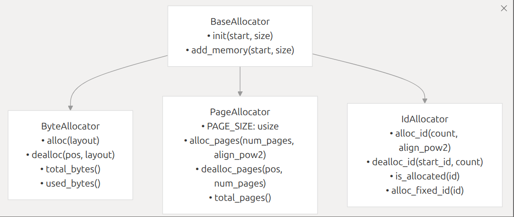
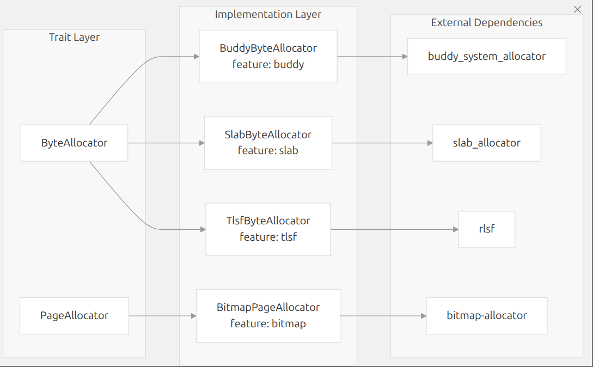

### allocator模块概述

该项目实现了多种内存分配算法，通过统一的接口将这些算法封装起来，方便开发者根据不同的需求选择合适的分配器。项目支持多种特性开关，可根据需要启用不同的分配器。
- **target中有另一个同名doc文件夹，其中有html文件可以在浏览器交互阅读**

### 项目结构和模块

- **`src/lib.rs`**: 项目的核心文件，定义了统一的分配器接口，包括`BaseAllocator`、字节粒度分配器、页粒度分配器和唯一 ID 分配器的接口。同时，提供了一些辅助函数，如地址对齐和检查对齐的函数。此外，还实现了 `AllocatorRc` 结构体，用于将字节分配器包装成 `core::alloc::Allocator` 类型。
- **`src/bitmap.rs`**: 实现了基于位图的页粒度内存分配器 `BitmapPageAllocator`。使用位图来跟踪每个页面的分配状态，支持不同大小的内存范围。
- **`src/buddy.rs`**: 实现了基于伙伴系统的字节粒度内存分配器 `BuddyByteAllocator`。使用 `buddy_system_allocator` 库来管理内存。
- **`src/slab.rs`**: 实现了基于 slab 分配器的字节粒度内存分配器 `SlabByteAllocator`。使用 `slab_allocator` 库来管理内存。
- **`src/tlsf.rs`**: 实现了基于 TLSF（Two-Level Segregated Fit）算法的字节粒度内存分配器 `TlsfByteAllocator`。使用 `rlsf` 库来管理内存。
- **`benches/collections.rs`**: 使用 criterion 库编写的​​内存分配器性能基准测试套件​​，定义了三种内存操作场景，模拟真实应用场景中的内存使用模式：vec_push,vec_rand_free,btree_map，分别对应的是模拟动态数组增长，模拟内存碎片化场景，模拟关联容器操作
- **`benches/utils/mod.rs`**: 实现了一个简单的​​固定大小内存池​​（MemoryPool），主要用于管理预分配的内存块

### Feature

#### 项目中通过 `cfg` 特性开关来控制不同模块和功能的编译，以下是所有可用的特性开关及其作用

##### 1. **`bitmap`**

- **作用**：启用基于位图的页粒度内存分配器。
- **关联模块**：`bitmap.rs`
- **导出类型**：`BitmapPageAllocator`
- **功能**：使用位图数据结构管理页级内存分配，适合管理大块连续内存区域。

##### 2. **`buddy`**

- **作用**：启用基于伙伴系统的字节粒度内存分配器。
- **关联模块**：`buddy.rs`
- **导出类型**：`BuddyByteAllocator`
- **功能**：基于伙伴系统算法实现细粒度内存分配，适合需要处理不同大小内存块的场景。

##### 3. **`slab`**

- **作用**：启用基于 slab 分配器的字节粒度内存分配器。
- **关联模块**：`slab.rs`
- **导出类型**：`SlabByteAllocator`
- **功能**：针对特定大小对象的高效分配，减少内部碎片，适合频繁分配 / 释放相同大小对象的场景。

##### 4. **`tlsf`**

- **作用**：启用基于 TLSF（Two-Level Segregated Fit）算法的字节粒度内存分配器。
- **关联模块**：`tlsf.rs`
- **导出类型**：`TlsfByteAllocator`
- **功能**：结合多级空闲列表和位图索引，实现高效的内存分配与回收，尤其适合分配不同大小内存块的场景。

##### 5. **`allocator_api`**

- **作用**：启用与 Rust 标准库内存分配器接口的集成。
- **关联模块**：`allocator_api` 子模块
- **导出类型**：`AllocatorRc`
- **功能**：将自定义字节分配器（`ByteAllocator`）包装为实现 `core::alloc::Allocator` 特征的类型，允许在需要标准分配器接口的场景中使用自定义分配器（如 `Rc`、`Box` 等）。

### Trait
- 基于trait对项目整体结构进行介绍

### 具体实现
#### lib.rs
